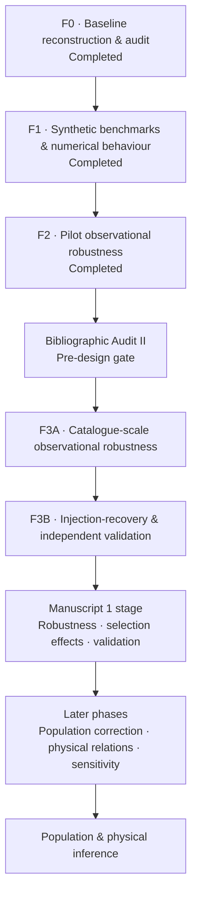

<div align="center">

# TESS QPP

### Robustness, selection effects, and validation in short-period quasi-periodic pulsations observed with TESS

[](https://marc-balboa-corominas.github.io/tess-qpp.html)
[](https://orcid.org/0009-0006-7571-9193)
[](#current-status)

**Independent research project · Stellar astrophysics · Scientific computing**

</div>

---

## Overview

**TESS QPP** is an independent research project investigating how methodological choices, observational selection effects, and validation procedures influence the detection and interpretation of short-period quasi-periodic pulsations (QPPs) in stellar flares observed by **TESS**.

The project began as a focused reproduction and methodological audit. That work developed into a broader question:

> **Which properties of the signal, the data, and the analysis procedure determine whether a QPP classification remains stable?**

Rather than moving directly from detections to physical interpretation, the project separates **baseline reconstruction**, **controlled synthetic testing**, **observational robustness**, **numerical behaviour**, **validation**, and later **population and physical inference** into explicit stages.

> **Research status:** active development  
> **F0–F2:** completed and frozen  
> **Current stage:** Phase 3 preparation  
> **Peer review:** not yet peer reviewed

---

## Why this project

QPP detection is not only a question of whether an apparent oscillatory signal is present. The result can also depend on choices such as the analysed temporal window, preprocessing, admissibility rules, model comparison, and numerical optimisation.

The first stages of this project therefore ask a methodological question before making stronger physical claims: **how robust is the classification to reasonable changes in the analysis procedure, and how can that robustness be validated?**

This distinction is central to the project because:

- classification stability is not the same as numerical optimiser stability;
- period stability is conditional on the event retaining QPP support;
- comparison events are not automatically known physical negatives;
- observational robustness does not by itself provide sensitivity, specificity, or physical ground truth;
- synthetic ground truth and held-out validation answer different questions from observational perturbation tests.

---

## Completed foundation

The first three phases are closed and preserved as a frozen methodological and observational foundation.

### F0 — Baseline reconstruction & audit

Reconstruction and audit of the effective analysis baseline, including the behaviour required to reproduce the relevant **AFINO 0.5** workflow and the observational inputs used in subsequent testing.

### F1 — Controlled synthetic benchmarks

Controlled experiments exploring detectability under synthetic conditions, including red-noise backgrounds, nested temporal windows, optimiser stability, numerical behaviour, and period recovery.

### F2 — Pilot observational robustness

Transfer of the methodological questions to a small observational pilot, testing how classifications and inferred quantities behave under reasonable perturbations of temporal window and processing choices.

The purpose of this foundation is methodological. It does **not** establish physical ground truth for individual QPP candidates.

Explore the frozen documentary foundation in [`foundation/f0-f2/`](foundation/f0-f2/).

---

## Current status

The F0–F2 foundation is complete. The project is now preparing the next observational and validation stages.

Current work is focused on:

- reviewing the recent methodological and observational literature;
- preparing the prospective design for catalogue-scale observational robustness;
- preserving explicit separation between exploratory development and later validation;
- maintaining traceable design, evidence, and decision records before stronger claims are made.

No scientific Phase 3 execution is considered final until the corresponding design and analysis boundaries are explicitly frozen.

---

## Research roadmap



The project is intentionally structured as a **long-lived research programme**, not as a repository tied to a single manuscript.

---

## Repository structure

```text
tess-qpp/
│
├── foundation/
│   └── f0-f2/          Frozen documentary foundation from completed phases
│
├── docs/
│   ├── decisions/      Project-level decision records
│   ├── governance/     Repository and artifact policy
│   ├── literature/     Literature-audit material
│   └── roadmap/        Scientific roadmap
│
├── workflows/
│   ├── phase3a/        Catalogue-scale observational robustness workspace
│   └── phase3b/        Injection-recovery and validation workspace
│
├── src/                Reusable project code
├── tests/              Reusable validation tests
├── data/               Data provenance and acquisition documentation
└── manuscripts/        Future manuscript workspaces
```

Large observational data, runtime checkpoints, materialised numerical arrays, caches, and other regenerated artifacts are deliberately kept outside normal Git history.

---

## Evidence and preservation model

The project uses different platforms for different scientific roles.

| Layer | Role |
|---|---|
| **GitHub** | Active version-controlled research workspace |
| **OSF** | Frozen snapshots, governance, protocols, and complete archival packages |
| **Zenodo** | Future public citable releases and DOI-bearing research objects |
| **arXiv** | Future manuscript preprints |

The complete byte-preserving F0–F2 archive is maintained separately from the Git-compatible documentary subset contained here. See [`foundation/f0-f2/ARCHIVE_RECORD.md`](foundation/f0-f2/ARCHIVE_RECORD.md) for the preservation record.

---

## Scientific boundaries

At the current stage, this project does **not** claim:

- observational validation of AFINO;
- physical truth for individual QPP labels;
- sensitivity or specificity;
- an observational false-positive rate;
- that comparison events are known physical negatives;
- a validated correction of the detection procedure;
- proof of a unique numerical optimum from stable classification alone.

These are not omissions from the project design. They define the questions that later stages are intended to address.

---

## Reproducibility and project history

The repository is maintained as an evolving research workspace with explicit scientific checkpoints.

Key principles:

1. **Historical evidence is not silently rewritten.** F0–F2 remains frozen under `foundation/`.
2. **Design precedes interpretation.** Important cohort, validation, and analysis decisions are recorded before corresponding results are promoted as final conclusions.
3. **Evidence layers remain separate.** Observational robustness, synthetic ground truth, numerical behaviour, and physical interpretation are not treated as interchangeable.
4. **Intermediate work is not a release.** A public commit may represent active development rather than a final scientific product.
5. **Future releases will be versioned explicitly.** Citable research objects will be frozen separately when the project reaches the corresponding release gate.

Project-level decisions can be inspected in [`docs/decisions/`](docs/decisions/).

---

## Follow the project

Major public updates are shared at selected scientific checkpoints rather than after every intermediate analysis step.

- **Project page:** [marc-balboa-corominas.github.io/tess-qpp.html](https://marc-balboa-corominas.github.io/tess-qpp.html)
- **Personal website:** [marc-balboa-corominas.github.io](https://marc-balboa-corominas.github.io/)
- **ORCID:** [0009-0006-7571-9193](https://orcid.org/0009-0006-7571-9193)
- **LinkedIn:** [Marc Balboa Corominas](https://www.linkedin.com/in/marc-balboa-corominas-b39a37172)

---

## Author

**Marc Balboa Corominas**  
Independent scientific project

> This repository documents research in active development. Material contained here should not be interpreted as peer-reviewed scientific evidence unless explicitly associated with a later released manuscript or citable research object.
