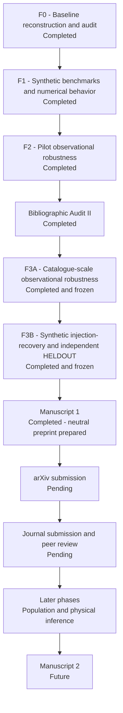

<div align="center">

# TESS QPP

### Reproducibility, methodological robustness, and synthetic-domain selection in short-period QPP analysis with TESS

[](https://marc-balboa-corominas.github.io/tess-qpp.html)
[](https://orcid.org/0009-0006-7571-9193)
[](#current-status)

**Independent research project | Stellar astrophysics | Scientific computing**

</div>

---

## Overview

**TESS QPP** is an independent research project investigating how methodological choices, observational selection effects, numerical behavior, and validation design influence the detection and interpretation of short-period quasi-periodic pulsations (QPPs) in stellar flares observed by **TESS**.

The project began as a focused reproduction and methodological audit and developed into a broader research program centered on a practical question:

> **Which properties of the signal, the data, and the analysis procedure determine whether a QPP classification remains stable, and what can be established when observational robustness and synthetic ground truth are kept explicitly separate?**

The program separates baseline reconstruction, controlled synthetic testing, observational robustness, numerical diagnostics, synthetic-ground-truth evaluation, and later population and physical inference into distinct evidence stages.

> **Research status:** active research program<br>
> **F0-F2:** completed and frozen<br>
> **Bibliographic Audit II:** completed<br>
> **F3A:** completed and frozen<br>
> **F3B:** completed and frozen<br>
> **Manuscript 1:** completed; journal-neutral arXiv preprint prepared<br>
> **arXiv:** submission pending<br>
> **Peer review:** not yet peer reviewed

---

## Why this project

QPP detection is not only a question of whether an apparent oscillatory signal is present. The result can also depend on choices such as the analyzed temporal window, preprocessing, admissibility rules, model comparison, and numerical optimization.

The project therefore treats reproducibility, robustness, and known-truth performance as different questions.

This distinction is central because:

- Classification stability is not the same as numerical optimizer stability.
- Period stability is conditional on the event retaining QPP support.
- Observational reference labels are not automatically physical ground truth.
- Observational robustness does not by itself provide sensitivity, specificity, or a false-positive rate.
- Synthetic ground truth supports known-truth metrics only within the designed simulation domain.
- A synthetic selection surface is not automatically an observational population correction.

---

## Completed research stages

### F0 - Baseline reconstruction and audit

Reconstruction and audit of the effective public AFINO 0.5 baseline and the observational input contract used downstream.

### F1 - Controlled synthetic benchmarks

Synthetic experiments exploring detectability, temporal support, optimizer stability, numerical behavior, and period recovery within a designed domain.

### F2 - Pilot observational robustness

A prospectively specified observational pilot testing how reference classifications change under temporal-window and processing perturbations.

The frozen F0-F2 documentary foundation is preserved in [`foundation/f0-f2/`](foundation/f0-f2/).

### Bibliographic Audit II

A bounded literature-positioning audit used to constrain wording, precedence, and comparator claims before the Phase 3 designs were finalized.

### F3A - Catalogue-scale observational robustness

Catalogue-scale application of the prospective robustness architecture, including an explicit baseline-reproduction gate, input-admissibility accounting, methodological transitions, numerical seed checks, and conditional period robustness.

F3A is complete and frozen.

### F3B - Synthetic injection-recovery and independent HELDOUT evaluation

A separately developed synthetic program with prospectively separated DEVELOPMENT and single-use HELDOUT evidence. The preregistered candidate-rule gate did not promote a replacement rule, so HELDOUT evaluated the untouched AFINO 0.5 10/10 baseline.

F3B is complete and frozen.

---

## Current status

The scientific work for **Manuscript 1** is complete.

The author-approved scientific content has been converted into a journal-neutral arXiv preprint package. The current pre-submission version includes a transparency acknowledgment describing selective use of generative AI for editorial and technical assistance. This disclosure does not alter the scientific results, claims, figures, tables, or conclusions.

The immediate publication sequence is:

1. Complete the public-infrastructure synchronization across GitHub, the project website, and OSF.
2. Verify all public links externally.
3. Complete the arXiv submission workflow.
4. After the preprint is public, proceed to journal submission and peer review.
5. Reserve later population and physical-inference work for subsequent phases rather than extending Manuscript 1 beyond its frozen evidence scope.

No arXiv identifier or journal-submission status is claimed here until those events actually occur.

---

## Manuscript 1

**Title:**
*Reproducibility, Methodological Robustness, and Synthetic-Domain Selection Properties of AFINO for TESS Stellar-Flare QPP Analysis*

The manuscript integrates the frozen evidence from F0, F1, F2, F3A, F3B, and the auxiliary Bibliographic Audit II while preserving their different truth conditions.

The journal-neutral preprint workspace is available at:

[`manuscripts/manuscript_01/preprint/arxiv_neutral/`](manuscripts/manuscript_01/preprint/arxiv_neutral/)

The first author-approved neutral freeze is preserved by the Git tag:

`manuscript1-arxiv-neutral-v1`

A transparency-only amendment adding the generative-AI acknowledgment is being preserved as the subsequent pre-submission neutral freeze. The original tag remains part of the project history and is not rewritten.

---

## Research roadmap



The repository represents a long-lived research program rather than a workspace tied to a single manuscript.

---

## Repository structure

```text
tess-qpp/
|
|-- foundation/
|   `-- f0-f2/          Frozen documentary foundation from completed phases
|
|-- docs/
|   |-- decisions/      Project-level decision records
|   |-- governance/     Repository and artifact policy
|   |-- literature/     Bibliographic-audit material
|   `-- roadmap/        Scientific roadmap
|
|-- workflows/
|   |-- phase3a/        Catalogue-scale observational robustness
|   `-- phase3b/        Synthetic injection-recovery and HELDOUT evaluation
|
|-- src/                Reusable project code
|-- tests/              Reusable validation tests
|-- data/               Data provenance and acquisition documentation
`-- manuscripts/        Manuscript workspaces and frozen publication artifacts
```

Large observational data, runtime checkpoints, materialized numerical arrays, caches, and other regenerated artifacts are deliberately kept outside normal Git history where appropriate.

---

## Evidence and preservation model

The project uses different platforms for different scientific roles.

| Layer | Role |
|---|---|
| **GitHub** | Version-controlled research workspace, code, protocols, evidence records, and manuscript history |
| **OSF** | Frozen snapshots, governance, protocols, and archival packages |
| **Zenodo** | Reserved for citable DOI-bearing research objects when a corresponding release is explicitly created |
| **arXiv** | Public manuscript preprint; submission pending |

The complete byte-preserving F0-F2 archive is maintained separately from the Git-compatible documentary subset contained here. See [`foundation/f0-f2/ARCHIVE_RECORD.md`](foundation/f0-f2/ARCHIVE_RECORD.md) for its preservation record.

---

## Scientific boundaries

The completed Manuscript 1 evidence does **not** establish:

- Observational physical validation of AFINO.
- Physical truth for individual observational QPP reference labels.
- Observational sensitivity, specificity, or false-positive rate.
- That observational comparison events are known physical negatives.
- A validated observational population correction.
- Transport of the frozen synthetic selection surface to the real TESS population.
- A unique optimizer solution merely because binary classifications are stable across the tested seed grid.

These boundaries are part of the scientific result, not omissions from the project record.

---

## Reproducibility and project history

The repository is maintained with explicit scientific checkpoints and preserved historical states.

Key principles:

1. **Historical evidence is not silently rewritten.** Earlier phases, decisions, protocols, and freezes remain inspectable in their original state.
2. **Design precedes interpretation.** Important analysis and validation boundaries are frozen before corresponding evidence is promoted as final.
3. **Evidence layers remain separate.** Observational reproduction, observational robustness, synthetic ground truth, numerical behavior, and physical inference are not treated as interchangeable.
4. **Intermediate work is not automatically a scientific release.** Public Git history documents development as well as frozen checkpoints.
5. **Publication states are stated literally.** A preprint, journal submission, peer review, acceptance, and final publication are treated as distinct events.

Project-level decisions are available in [`docs/decisions/`](docs/decisions/).

---

## Follow the project

Major public updates are shared at selected scientific checkpoints rather than after every intermediate analysis step.

- **Project page:** [marc-balboa-corominas.github.io/tess-qpp.html](https://marc-balboa-corominas.github.io/tess-qpp.html)
- **Personal website:** [marc-balboa-corominas.github.io](https://marc-balboa-corominas.github.io/)
- **ORCID:** [0009-0006-7571-9193](https://orcid.org/0009-0006-7571-9193)
- **LinkedIn:** [Marc Balboa Corominas](https://www.linkedin.com/in/marc-balboa-corominas-b39a37172)

---

## Author

**Marc Balboa Corominas**
Independent Researcher, Spain

> Manuscript 1 is complete and the journal-neutral preprint is prepared for arXiv submission. The work has not yet completed peer review.
